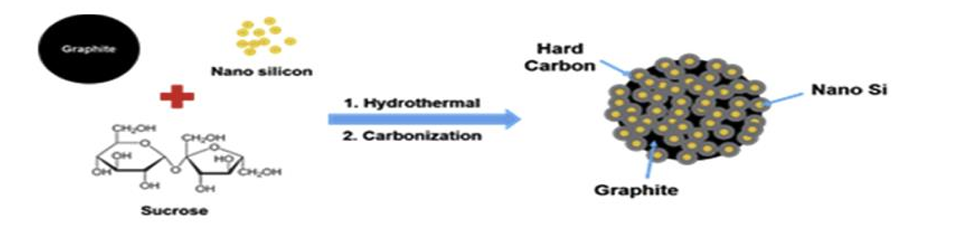
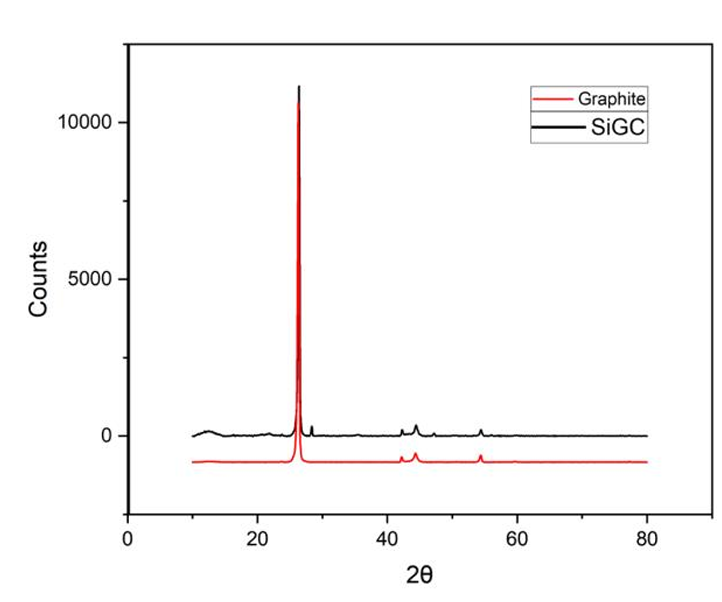
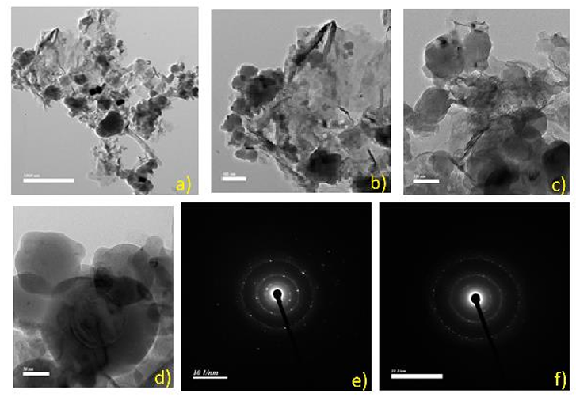
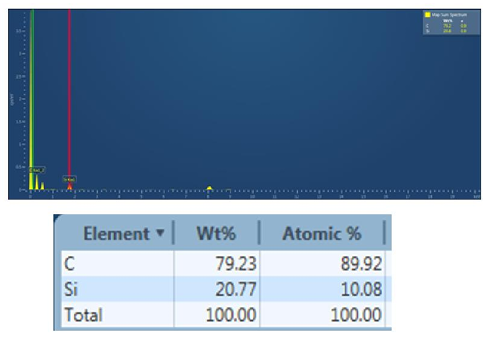
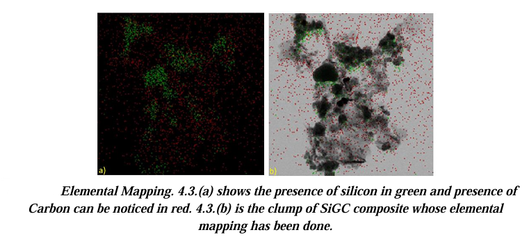
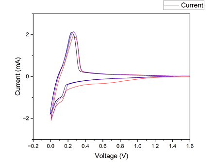
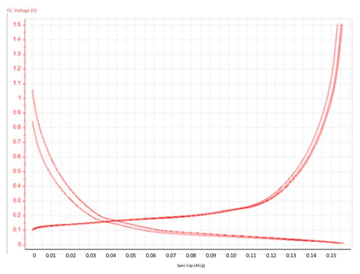
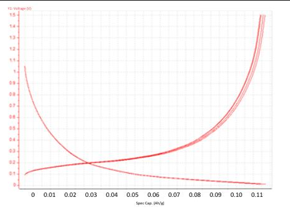

# SiGC Lithium-Ion Battery Anodes

### Development and electrochemical evaluation of sucrose-derived silicon–graphite–carbon composite anodes

## Overview

Silicon is a promising next-generation anode material for lithium-ion batteries because of its high theoretical specific capacity. However, large volume changes during lithiation/delithiation and associated electrode degradation limit its practical application.

This project investigated a silicon–graphite–carbon (SiGC) composite anode designed to combine silicon with a graphite matrix and sucrose-derived carbon.

The study focused on understanding how silicon particle-size control influences the electrochemical performance and cycling stability of the composite.

> **Manuscript status:** Final draft; publication in preparation.

---

### Experimental Approach

The work involved:

- Preparation of SiGC composite materials using sucrose.
- Hydrothermal treatment and carbonization.
- Electrode fabrication using the prepared composite.
- Structural and morphological characterization using XRD, TEM, EDS, and elemental mapping.
- Electrochemical evaluation using OCV, cyclic voltammetry, and charge–discharge testing.

---

### Key Findings

The study examined the relationship between composite processing, material structure, and electrochemical behavior. The reported results indicate that sucrose-derived carbon and processing conditions influence the structural characteristics and cycling performance of the SiGC electrodes.

The detailed numerical results are reported in the associated manuscript. Raw experimental data are not included in this repository.

---

### My Contribution

My contribution included composite preparation, materials characterization, electrochemical testing, analysis of the experimental results, and preparation of the research manuscript.

---

## Materials & Composition

The investigated SiGC composite used a **Si:G:C ratio of 3:10:7**.

| Component | Role |
|---|---|
| Silicon | High-capacity active material |
| Graphite | Conductive carbonaceous matrix |
| Sucrose-derived carbon | Carbon coating / composite component |

Two silicon conditions were investigated:

- **Unsieved Si:** Silicon powder used without sieving
- **Sieved Si:** Silicon powder passed through a **100 µm mesh**

---

## Processing & Electrode Fabrication

### SiGC Composite Synthesis

1. Silicon and graphite were combined according to the selected composition.
2. Sucrose was used as the carbon precursor.
3. The precursor mixture underwent hydrothermal processing.
4. The resulting material was vacuum dried.
5. Carbonization was performed under an argon atmosphere.

### Electrode Fabrication

The active SiGC material was combined with Super P conductive carbon and PVDF binder.

The slurry was:

- Mixed using a planetary centrifugal mixer
- Coated onto copper foil using a doctor blade
- Vacuum dried
- Calendered
- Punched into 14 mm electrode discs

Coin half-cells were assembled in an argon glovebox using lithium as the counter electrode.

---

## Experimental Workflow



---


## Characterization

### Structural & Microstructural Characterization

- ### X-ray Diffraction



- ### Transmission Electron Microscopy



- ### Energy-Dispersive X-ray Spectroscopy



- ### Elemental Mapping



### Electrochemical Characterization

- ### Cyclic Voltammetry



- ### Initial Charge–Discharge



- ### Final Charge–Discharge



---

## Key Results

### Specific Capacity

The six investigated half-cells showed specific capacities in the range of approximately **158–160 mAh/g**.

| Silicon condition | Reported highest capacity |
|---|---:|
| Unsieved | **160 mAh/g** |
| 100 µm sieved | **158.31 mAh/g** |

The unsieved material showed a slightly higher initial specific capacity.

### Capacity Retention

After 100 cycles, the sieved composite showed better retention:

| Silicon condition | Capacity retention after 100 cycles |
|---|---:|
| Unsieved | **76.5%** |
| 100 µm sieved | **85%** |

This indicates a trade-off between initial capacity and long-term cycling stability.

---

## Electrochemical Behavior

The representative B2 half-cell was evaluated by cyclic voltammetry between **0.005 and 1.5 V** at a scan rate of **0.1 mV/s** for four cycles.

The first cycle differed from subsequent cycles, while cycles 2–4 showed comparatively similar behavior.

Charge-discharge profiles showed:

- Initial capacities above 150 mAh/g
- Lower capacity during later cycling
- More uniform charge-discharge behavior during cycles 96–100

---

## Structural & Microstructural Findings

XRD identified diffraction features associated with graphite and crystalline silicon. The manuscript reports no detectable formation of SiC by-products.

Elemental mapping and TEM were used to examine the distribution of silicon and carbon. The study reports carbon encapsulation/coating around nano-Si and adhesion of the carbon-coated silicon to the graphite surface.

The carbonaceous component was investigated as a potential means of improving electrical transport and accommodating silicon volume changes during cycling.

---

## Research Insight

The comparison between sieved and unsieved silicon highlighted an important processing–performance relationship:

**Slightly higher initial capacity ≠ better long-term cycling stability.**

The unsieved SiGC composite achieved the highest reported initial capacity, while the sieved composite demonstrated substantially better capacity retention after 100 cycles.

This makes silicon particle-size control an important processing variable for balancing capacity and cycling durability.

---

**Skills Demonstrated**

_Materials & Processing_

- Composite anode fabrication
- Solution/precursor processing
- Hydrothermal synthesis
- Carbonization
- Electrode fabrication
- Calendering

_Materials Characterization_

- XRD
- TEM
- EDS
- Elemental mapping

_Electrochemical Characterization_

- Cyclic voltammetry
- Galvanostatic charge-discharge
- Open-circuit voltage
- Electrochemical impedance spectroscopy

_Materials Analysis_

- Structure–property interpretation
- Processing–performance relationships
- Electrochemical performance comparison
- Cycling stability analysis
- Research Context

This work was conducted as part of research at the **Energy Science Laboratory, IISER Pune**, with support from the **Department of Metallurgy and Materials Technology, COEP Technological University**.

The manuscript acknowledges the guidance of **Dr. Satishchandra Ogale and his research team**.

---

## Project Workflow

```text
Si + Graphite + Sucrose
          ↓
   Hydrothermal Treatment
          ↓
       Drying
          ↓
  Carbonization under Ar
          ↓
       SiGC Composite
          ↓
   Electrode Fabrication
          ↓
     Coin Half-Cells
          ↓
 ┌────────┼─────────┐
 ↓        ↓         ↓
XRD     TEM/EDS   Electrochemistry
                    ↓
          CV + Charge/Discharge
                    ↓
        Capacity & Cycling Analysis

